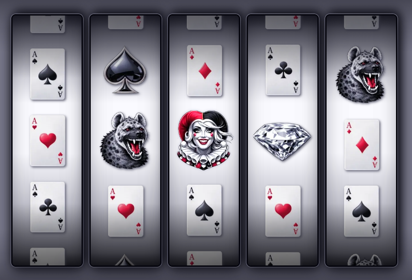
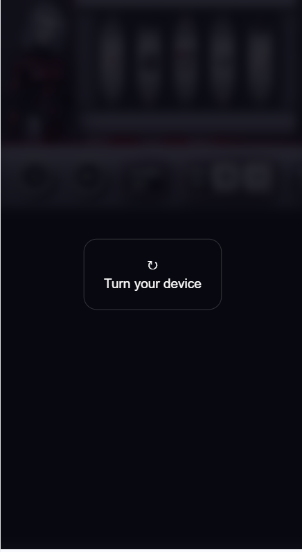
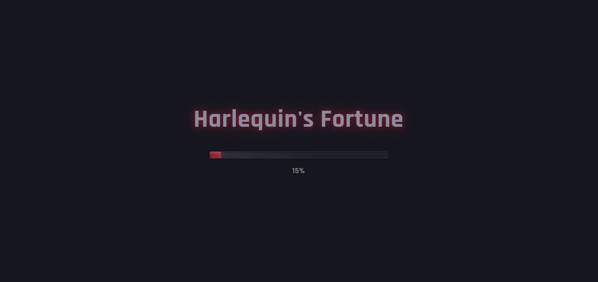

# Harlequin's Fortune - Case Study

## Úvod a koncept

S nápadem na **Harlequin's Fortune** slot machine hru jsem přišla již před více než rokem a půl, kdy jsem pracovala ve firmě z oboru hazardních her. Zaujalo mě, kolik existuje Joker her, ale žádná není věnovaná postavě Harley Quinn. Jelikož je Harley pod copyrightem DC Comics, rozhodla jsem se pro hru ve stylu **Harlequin** – klasické postavy z commedia dell'arte, která využívá stejné barevné schéma a estetiku.

V té době jsem nevěděla absolutně nic o programování a neznala ani základy HTML, takže jsem si na realizaci hry musela počkat.

---

## Původní návrh a vize

Prvotní návrh jsem vytvořila ve **Figmě** s využitím výhradně AI generovaných obrázků. Design není úplně striktně sladěný co se odstínů týče – kromě červené se tam místy objevuje i zlatá.

### Původní koncept

- Styl luxusních casino her
- Opulentní prvky (sloupy v popředí, zdobené rámy)
- Barevné schéma: černá, bílá, červená (+ lehké akcenty zlaté)
- 5 válců × 3 řady
- Tradiční retro feeling, ale s originálním provedením

### Problémy původního návrhu

- Sloupy v popředí by byly nestabilní na různých velikostech displeje
- Design působil přeplněně
- Světlé pozadí špatně kontrastovalo s herními válci
- Obtížná realizace responzivního layoutu


---

## Cesta k realizaci

Samotnému vytvoření hry předcházelo **více než rok učení** a praxe na menších projektech. Po vytvoření Figma návrhu jsem začala studovat webový vývoj od základů:

- **HTML, CSS, JavaScript** - fundamenty
- **React a TypeScript** - moderní frameworky
- **Responzivní design** - mobile-first přístup
- **Git verzování** - profesionální workflow
- **Accessibility standardy** (WCAG)
- **Testování a optimalizace** webových aplikací

Teprve s těmito znalostmi jsem mohla začít přetvářet původní Figma návrh do funkční hry.

---

## Technologie a nástroje

Pro realizaci hry jsem zvolila moderní technologický stack:

- **React 19** – nejnovější verze pro tvorbu uživatelského rozhraní
- **TypeScript** – type-safe vývoj a lepší developer experience
- **Vite** – rychlý build tool a dev server
- **CSS3** – styling, animace, responzivní design
- **Git & GitHub** – verzování a hosting (GitHub Pages)

Kombinace **React 19 + TypeScript + Vite** poskytuje rychlý development, type safety a optimalizovaný production build, což je ideální pro interaktivní aplikace jako jsou hry.

---

## Design a implementace UI

### Úpravy oproti originálnímu návrhu

Při vlastním navrhování v CSS jsem odstíny sjednotila a používám pouze **jeden odstín červené** (`#dc143c`), podle kterého jsem upravila i obrázky ve hře. Symboly se nyní skládají z AI obrázků i obrázků z fotobanky **Freepik**.

**Klíčové změny:**

- Upustila jsem od sloupů v popředí
- **Výrazně tmavší pozadí** (`#06060e`) pro lepší kontrast
- Minimalistický, ale elegantní design
- Důraz na čitelnost a použitelnost


### CSS architektura

Pro styling aplikace jsem vytvořila robustní systém založený na **CSS custom properties (proměnných)**:

```css
:root {
    /* Barevná paleta */
    --primary-black: #06060e;
    --pure-white: #ffffff;
    --accent-red: #dc143c;
    
    /* Metalické odstíny */
    --silver: #babace;
    --chrome: #dadaee;
    
    /* Gradienty pro kovový efekt */
    --panel-gradient: linear-gradient(
        to bottom,
        var(--secondary-black) 0%,
        var(--chrome) 4%,
        var(--silver) 14%,
        var(--dark-silver) 50%,
        var(--dark-grey) 99%
    );
}
```

**Metalické efekty:**  
Pro dosažení realistického vzhledu menu a okrajů používám komplexní CSS gradienty, které simulují chromované a stříbrné povrchy.

### Technická realizace válců

Snažila jsem se co nejvíce přiblížit reálným 3D válcům:

- Bílý povrch válců s jemným gradientem – světlejší uprostřed, tmavší na okrajích
- Dva dodatečné gradienty nahoře a dole zajišťují stínování na povrchu i symbolech
- Symboly se pohybují na transparentním pozadí
- **9 symbolů na válec** pro plynulou animaci (`[...reel, ...reel, ...reel]`)
- Viditelné jsou vždy prostřední 3 symboly



### Responzivita

Na rozdíl od jiných projektů zde rozlišuji nejen šířku displeje, ale i **orientaci zařízení** (portrait/landscape):

```css
/* Základní škálování pro menší displeje */
@media (max-width: 949px) {
    .game-field {
        transform: scale(calc(100vw / 950px));
    }
}

/* Landscape režim - specifické škálování */
@media (orientation: landscape) and (max-height: 799px) {
    .game-field {
        transform: scale(0.85);
        transform-origin: top center;
    }
}

/* Portrait režim - zobrazení rotate overlay */
@media (orientation: portrait) and (max-width: 480px) {
    .rotate-overlay {
        display: flex;
    }
}
```

**Rotate overlay:**  
Vůbec poprvé jsem v projektu implementovala fullscreen overlay s výzvou k otočení zařízení:

```css
.rotate-overlay {
    display: none;
    position: fixed;
    inset: 0;
    z-index: 9999;
    background: rgba(0,0,0,.85);
    backdrop-filter: blur(6px);
    align-items: center;
    justify-content: center;
}

/* Zobrazí se pouze v portrait režimu na malých displejích */
@media (orientation: portrait) and (max-width: 480px) {
    .rotate-overlay {
        display: flex;
    }
}
```

Když uživatel drží telefon v portrait režimu, zobrazí se overlay s ikonou a textem "Turn your device". Toto řešení výrazně zlepšuje uživatelský zážitek na mobilních zařízeních.



### Škálování aplikace

Pro konzistentní vzhled napříč různými velikostmi displejů používám vlastní škálovací systém pomocí CSS proměnné `--game-scale`, která dynamicky přepočítává velikost celé aplikace.

---

## Responzivní úpravy pro mobilní zařízení

Během vývoje jsem byla nucena **dvakrát upravit layout** kvůli použitelnosti:

### 1. Změna ovládání bet amount

**Problém:** Původní šipky nahoru/dolů dosahovaly na mobilu příliš malých rozměrů (pod 44×44px WCAG minimum).

**Řešení:**

- Přemístění tlačítek **vedle sebe** místo nad sebe
- Změna ikon ze šipek na **+ a –** symboly
- Dynamická změna ikon podle breakpointu pomocí React hooks:

```typescript
const [showPlusMinus, setShowPlusMinus] = useState(false);

useEffect(() => {
    const checkLayout = () => {
        const isMobile = window.innerWidth <= 668;
        const isLandscape = window.matchMedia('(orientation: landscape) and (max-height: 431px)').matches;
        setShowPlusMinus(isMobile || isLandscape);
    };
    
    checkLayout();
    window.addEventListener('resize', checkLayout);
    window.addEventListener('orientationchange', checkLayout);
    
    return () => {
        window.removeEventListener('resize', checkLayout);
        window.removeEventListener('orientationchange', checkLayout);
    };
}, []);
```


### 2. Úprava pro velmi malá zařízení

Pro displeje s malou šířkou jsem **přemístila tlačítko hlasitosti** z levé části bottom menu do pravého horního rohu. Tato změna je provedena čistě v CSS pomocí positioning.

Zvažovala jsem vliv změny vizuálního umístění na **DOM pořadí a accessibility**, ale považuji řešení za přijatelné – tlačítko zůstává technicky součástí bottom menu (správné pořadí pro screen readery), jen je vizuálně umístěno jinde.

---

## Konfigurace a optimalizace

### HTML meta tagy

**Viewport a škálování:**  
Navzdory obecnému doporučení WCAG jsem **záměrně zakázala škálování** (`user-scalable=no`). Toto rozhodnutí je u slot machine her standardní praxe – zabráním tak nežádoucímu zoomu během hraní.

**Favicons:**  
Implementovala jsem **kompletní sadu favicon** pro různá zařízení a platformy, které jsem generovala pomocí nástroje **Favicon.io**.

**Web App Manifest:**  
Pro zajištění správného zobrazení při přidání na domovskou obrazovku:

```json
{
    "name": "Harlequin's Fortune",
    "theme_color": "#dc143c",
    "background_color": "#16161e",
    "display": "standalone"
}
```

---

## Architektura aplikace

### Struktura komponent

Aplikace je postavena na třech hlavních komponentách:

#### 1. GameField.tsx – Hlavní herní komponenta

- Kompletní herní logika (spin, checkWin, checkLineForWin, checkScatterWin)
- Správa game state (credit, bet, win, isSpinning)
- Přijímá data ze `data.tsx`
- Předává funkce do child komponent pomocí props

#### 2. BottomPanel.tsx – Ovládací panel

- Zpracovává interakce ze strany hráče
- Implementuje responzivní změnu ikon
- Rotační animace spin tlačítka

#### 3. Reels.tsx – Zobrazení symbolů

- Renderuje herní válce a symboly
- Triplikace symbolů pro plynulou animaci
- Dynamicky přidává třídy pro animace (spinning, winning, wild-animate)

**Modální komponenty:**

**MenuModal.tsx:**

- Zobrazuje pravidla hry, paytable, RTP statistiky
- Data načítá dynamicky ze `data.tsx`
- Minimalizuje riziko chyb při změně dat


**NoCreditModal.tsx:**

- Minimalistický design se dvěma tlačítky
- Implementuje focus management pro accessibility

**LoadingScreen.tsx:**

- Zobrazuje se při inicializaci aplikace
- "Fake" progress bar s plynulou animací (1.2s)
- Maskuje initial React render
- Konzistentní design s herním stylem
- Fade-in/fade-out animace

Implementace využívá simulovaný progress místo skutečného načítání assetů, což je standardní praxe pro malé React hry, kde jsou assety zabaleny v bundle a načítají se velmi rychle. Tento přístup zajišťuje konzistentní UX na všech zařízeních.



**Ikony:**  
Pro herní ikony využívám knihovnu **React Icons** s kolekcemi Font Awesome 5 a 6.

### Custom hooks

**useLocalStorage:**  
Hook pro persistenci dat v prohlížeči (credit, bet, isSoundOn).

**useSound:**  

Hook pro správu zvukových efektů:

- Background music (waltz.mp3) – přehrává se ve smyčce
- Zvukové efekty – jednorázové přehrání při akcích
- Všechny zvuky z royalty-free databáze **Pixabay**

### Optimalizace assetů

- Všechny obrázky zmenšeny pomocí **TinyPNG**
- MP3 soubory optimalizovány online nástrojem
- **Preload zvuků tlačítek** – okamžité přehrání bez zpoždění

```typescript
useEffect(() => {
    const sounds = [
        `${base}sounds/button.mp3`,
        `${base}sounds/whoosh.mp3`,
    ];
    
    sounds.forEach(sound => {
        const audio = new Audio(sound);
        audio.load();
    });
}, [base]);
```

---

## Accessibility (WCAG)

### ARIA atributy

Pro zajištění přístupnosti používám ARIA atributy na všech interaktivních prvcích:

**BottomPanel.tsx:**

- Všechna tlačítka: `aria-label`, `role="button"`, ikony s `aria-hidden="true"`
- Sound button: `aria-pressed={isSoundOn}`
- Live regions: `role="status"`, `aria-live="polite"/"assertive"`
- Skupiny: `role="group"`, `aria-labelledby`

**GameField.tsx:**

- Visually hidden H1
- Win announcement s `aria-live="assertive"`
- Rotate overlay: `role="alert"`

**Reels.tsx:**

- Container: `role="region"`, `aria-busy={isSpinning}`
- Neviditelné symboly: `aria-hidden={!isVisible}`

### Color accessibility

Barevné schéma (černá, bílá, červená) je ověřeno jako bezpečné pro všechny typy barvosleposti. Kontrast ratios splňují WCAG standardy (4.5:1 text, 3:1 UI komponenty).

---

## Implementace herní logiky

### React Hooks

- **useState** – správa stavu (credit, bet, win, isSpinning)
- **useEffect** – side effects (preload zvuků, kontrola kreditu)
- **useRef** – práce s DOM elementy a uchování aktuálních hodnot v closures

### Generování symbolů

Symboly generuji dynamicky pomocí cyklu `for`:

```typescript
const generateRandomSymbols = (): string[][] => {
  const result: string[][] = [];
  
  for (let i = 0; i < 5; i++) {
    const reel: string[] = [];
    for (let j = 0; j < 3; j++) { 
      reel.push(getWeightedRandomSymbol());
    }
    result.push(reel);
  }
  
  return result;
}
```

### Technické problémy a jejich řešení

**1. Autospin a zvukové efekty**  
Zajistila jsem, že se zvuk stisknutí tlačítka autospin přehraje pouze jednou při zapnutí.

**2. Načasování win animace**  
Musela jsem zvolit správnou délku pauzy po výhře (**5500ms**), aby se stihla provést celá výherní animace a přehrát celý win zvuk před dalším spinem při autospinu.

**3. Práce s aktuálními hodnotami kreditu**  
Nejtěžší bylo zajistit, aby hra vždy pracovala s aktuálními hodnotami kreditu, zejména při autospinu. React state se aktualizuje asynchronně, což způsobovalo problémy v closures.

**Řešení:** Používám `useRef` pro uchování aktuální hodnoty:

```typescript
const creditRef = useRef(credit);

useEffect(() => {
    creditRef.current = credit;
}, [credit]);

// Pak v handleSpin:
if (creditRef.current < bet) {
    // Out of credits
}
```

**4. Kontrola dostatečného kreditu**  
Původně jsem kontrolovala kredit pomocí `<=`, což ale znemožňovalo hru i když se kredit rovnal aktuální sázce. Finální řešení používá `<`.

---

## Herní mechanika

**Struktura:**

- **5 válců × 3 řady** = 15 pozic
- **10 paylines** (výherních linií)
- **11 symbolů** rozdělených do 4 kategorií
- **Minimální výhra:** 3 stejné symboly v řadě (zleva doprava)
- **Wild symbol** (Harlequin) – nahrazuje všechny symboly kromě Scatter
- **Scatter symbol** (Diamond) – vyplácí kdekoli na válcích

### Návrh symbolů a jejich hodnot

Tvorbě samotné hry předcházela pečlivá příprava herních dat. Symboly jsem rozdělila do kategorií podle hodnoty:

| Kategorie | Symboly | Payouts (3×/4×/5×) | Weight |

|-----------|---------|-------------------|--------|

| **Low value** | Spades, Clubs, Diamonds, Hearts | 4 / 8 / 16 | 90 |
| **Medium value** | Diamond-Spades, Diamond-Clubs, Diamond-Diamonds, Diamond-Hearts | 6 / 14 / 35 | 65 |
| **High value** | Hyena | 12 / 30 / 90 | 40 |
| **Scatter** | Diamond | 3 / 8 / 25 | 15 |
| **Wild** | Harlequin | 20 / 60 / 300 | 12 |

**Celková suma vah:** `(4×90) + (4×65) + 40 + 15 + 12 = 687`

### Výpočet pravděpodobností

Pro každý symbol:

```P(symbol) = weight / total_weight
```

**Příklady:**

- P(Low value karta) = 90 / 687 ≈ **13.10%**
- P(Medium value) = 65 / 687 ≈ **9.46%**
- P(Hyena) = 40 / 687 ≈ **5.82%**
- P(Scatter) = 15 / 687 ≈ **2.18%**
- P(Wild) = 12 / 687 ≈ **1.75%**

---

## Ladění herního modelu

### Iterativní proces

Výherní hodnoty (payouts) i váhy symbolů jsem během vývoje **několikrát upravovala**, abych se přiblížila RTP reálných slot machine her (obvykle 94-96%).

**Klíčové zjištění:**  
Při změně vah je nutné si uvědomit, že měním **celkovou sumu**, což ovlivňuje pravděpodobnosti **všech symbolů**, ne jen těch které upravuji.

**Finální úprava:**  
Zvýšení wild symbolu z weight 10 na **12** mělo dramatický efekt na RTP:

- Wild má nejvyšší payouts (20/60/**300**!)
- Wild substituce vytváří mnohem více výher
- Zvýšení o 20% více wild symbolů = výrazný nárůst RTP

---

## Testování a RTP analýza

### Monte Carlo simulace

**Co to je:**  
Monte Carlo metoda je statistická technika, která používá náhodné vzorkování k získání numerických výsledků. V kontextu slot machine her to znamená simulovat **miliony spinů** a měřit průměrný výsledek.

**Proč ji používat:**

- **Přesnost** – při 1M+ spinů se výsledek blíží teoretické hodnotě
- **Komplexita** – zahrnuje všechny herní mechaniky (wild substituce, scatter, paylines)
- **Ověření** – potvrdí, že implementace RNG a výher funguje správně

### Implementace testu

Vytvořila jsem samostatnou komponentu **Test.ts**, která simuluje 1 milion spinů a měří:

- RTP (Return to Player)
- Hit Rate (frekvence výher)
- Volatilitu
- Distribuci výher
- Symbol frequency

### Výsledky testování

**Manuální testování:**

- Počáteční kredit: 1000
- Testovaná sázka: 20-200 bodů
- Autospin: pozorování rychlosti vyčerpání kreditu

**Monte Carlo simulace (1M spinů):**
#### Základní metriky

| Metrika | Hodnota |
|---------|---------|
| **RTP** | 95.3% |
| **Hit Rate** | ~14% |
| **Volatilita** | Medium |
| **Max Win** | 2400 (120x bet) |
| **Průměrná výhra** | 130.48 |
| **Trvání testu** | 1.6s |

#### Distribuce výher

| Kategorie | Procento |
|-----------|----------|
| Malé výhry (1-10x) | 85.5% |
| Střední výhry (10-50x) | 14.4% |
| Velké výhry (50-100x) | 0.0% |
| Mega výhry (100x+) | 0.0% |

#### Ověření RTP napříč bet hodnotami

| Bet | Test 1 | Test 2 | Průměr |
|-----|--------|--------|--------|
| 10 | 95.06% | - | 95.06% |
| 20 | 95.62% | 95.33% | 95.48% |
| 50 | 95.08% | - | 95.08% |
| 100 | 96.03% | 95.13% | 95.58% |
| 200 | 95.18% | 95.35% | 95.27% |

**Celkový průměr: 95.29%** ✅

#### Symbol Frequency

| Symbol | Skutečnost | Očekávání | Rozdíl |
|--------|-----------|-----------|--------|
| Spades | 13.14% | 13.10% | +0.04% |
| Clubs | 13.13% | 13.10% | +0.03% |
| Diamonds | 13.13% | 13.10% | +0.03% |
| Hearts | 13.12% | 13.10% | +0.02% |
| Diamond Spades | 9.50% | 9.46% | +0.04% |
| Diamond Clubs | 9.50% | 9.46% | +0.04% |
| Diamond Diamonds | 9.51% | 9.46% | +0.05% |
| Diamond Hearts | 9.48% | 9.46% | +0.02% |
| Hyena | 5.84% | 5.82% | +0.02% |
| Diamond Scatter | 2.19% | 2.18% | +0.01% |
| Harlequin Wild | 1.46% | 1.75% | -0.29% |

**Symbol frequency prakticky perfektně odpovídá očekávání** – RNG funguje správně!

### Závěry z testování

✅ **RTP je stabilní ~95.3% napříč všemi bet hodnotami**  
✅ **Variance ±0.5-1%** je normální pro Monte Carlo simulace  
✅ **Férová hra** – žádné preference pro vysoké/nízké sázky  
✅ **Profesionální úroveň** – ideální pro komerční slot games (94-96%)

**Proč komerční hry používají vyšší RTP:**

- **Konkurence** – hráči si RTP kontrolují
- **Player retention** – vyšší RTP = hráč prohrává pomaleji = hraje déle
- **Casino vydělává na objemu**, ne na jednotlivých spinech
- **Regulace** – některé jurisdikce vyžadují minimální RTP 92-94%

---

## Deployment

Pro nasazení aplikace využívám **GitHub Pages** s automatizovaným deployment procesem.

### Konfigurace

**package.json:**

```json
{
  "homepage": "https://alena0490.github.io/SlotGame/",
  "scripts": {
    "predeploy": "npm run build",
    "deploy": "gh-pages -d dist"
  }
}
```

**vite.config.ts:**

```typescript
export default defineConfig({
  plugins: [react()],
  base: '/SlotGame/',
})
```

### Dynamické cesty k assetům

Po deployi bylo nutné upravit všechny cesty k souborům pomocí Vite environment proměnné:

```typescript
const base = import.meta.env.BASE_URL;

// Použití:
playSound(`${base}sounds/button.mp3`);
<audio src={`${base}sounds/waltz.mp3`} />
```

Tím se automaticky přidá správný prefix (`/SlotGame/`) v produkci, zatímco v dev režimu zůstane jen `/`.

### Deployment proces

1. `npm run deploy` spustí `predeploy` script
2. Vytvoří production build
3. Obsah složky `dist` se nahraje na GitHub Pages
4. Aplikace dostupná na `https://alena0490.github.io/SlotGame/`

---

## Výsledky a závěr

### Co se povedlo

✅ **Profesionální RTP 95.3%** – na úrovni komerčních her  
✅ **Kompletní WCAG accessibility** – použitelné pro všechny uživatele  
✅ **Plně responzivní** – funguje na všech zařízeních  
✅ **Optimalizovaný výkon** – rychlé načítání, plynulé animace  
✅ **Loading screen** – profesionální první dojem  
✅ **Čistý, maintainovatelný kód** – TypeScript, modularita  
✅ **Ověřená spravedlivost hry** – Monte Carlo testování

### Technické achievementy

- **Realistické 3D válce** s CSS gradienty
- **Dynamická responzivita** s orientací a škálováním
- **Komplexní herní logika** s wild substitucí a scatter mechanikou
- **Custom hooks** pro sound management a localStorage
- **Accessibility first** přístup
- **Automatizované testování** s Monte Carlo simulací

### Lessons learned

**1. Důležitost matematického modelu:**  
RTP není náhoda – každá změna vah ovlivňuje celou hru. Pochopení pravděpodobností je klíčové.

**2. Testing je nezbytný:**  
Monte Carlo simulace odhalila, jak malé změny (wild 10→12) mohou mít velký dopad (+4.5% RTP).

**3. Accessibility není volitelná:**  
WCAG standardy dělají hru lepší pro všechny, nejen pro uživatele se zdravotním postižením.

**4. Responzivita vyžaduje testování:**  
Různé breakpointy, orientace a zařízení vyžadují pečlivé testování na reálných zařízeních.

**5. useRef pro async problém:**  
React state updates jsou asynchronní – useRef zachraňuje situaci při práci s closures.

### Budoucí vylepšení

- **Další herní mechaniky** (free spins, multipliers)
- **Animace výher** s particles efekty
- **Leaderboard** s localStorage

---

## Závěr

**Harlequin's Fortune** je plně funkční slot machine hra, která kombinuje profesionální design s technickou excelencí. Projekt prokázal mé schopnosti v:

- **Full-stack vývoji** (React, TypeScript, CSS)
- **Matematickém modelování** (pravděpodobnosti, RTP)
- **Testování a QA** (Monte Carlo simulace)
- **UI/UX designu** (responzivita, accessibility)
- **Deployment a DevOps** (GitHub Pages, Vite)

Hra dosahuje **RTP 95.3%**, což je na úrovni profesionálních casino her, a splňuje všechny **WCAG accessibility** standardy. Celý projekt je důkazem, že komplexní interaktivní aplikace lze vytvořit s moderními web technologiemi a důkladným přístupem k testování.

---

**Live Demo:** [https://alena0490.github.io/SlotGame/](https://alena0490.github.io/SlotGame/)  
**GitHub Repository:** [https://github.com/alena0490/SlotGame](https://github.com/alena0490/SlotGame)

**Design & Development:** Alena Pumprová  
**Rok:** 2025  
**Technologie:** React 19, TypeScript, Vite, CSS3
