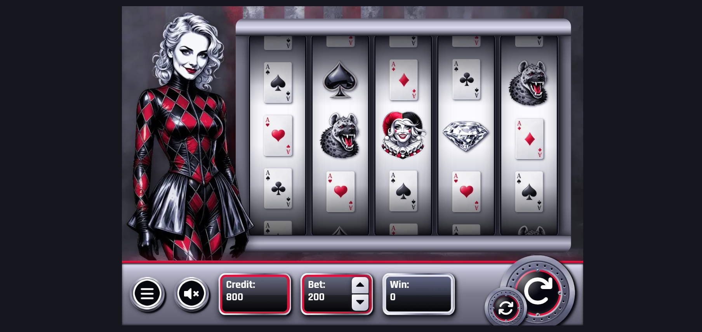
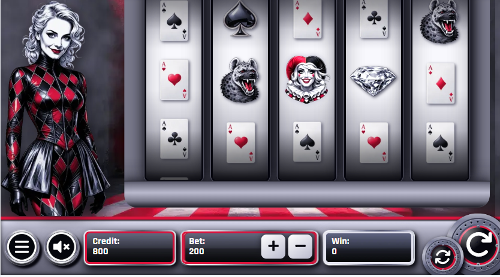

# 🎰 Harlequin's Fortune

Professional portfolio demo slot machine game inspired by the aesthetics of commedia dell'arte. Features authentic casino mechanics, Monte Carlo tested RTP, and full WCAG accessibility compliance.


## 🎮 Live Demo

**Play now:** [alena0490.github.io/SlotGame](https://alena0490.github.io/SlotGame/)

## ✨ Features

- **Professional RTP:** 95.3% (verified by 1M+ spin Monte Carlo simulation)
- **10 Paylines** with wild substitution and scatter wins
- **11 Unique Symbols** across 4 value tiers
- **Responsive Design** - optimized for all devices
- **WCAG Accessibility** - full keyboard navigation and screen reader support
- **Sound Effects** - immersive audio with user control
- **Auto-spin Mode** - automated gameplay
- **LocalStorage** - persistent credit and bet values

## 🛠️ Technologies

- **React 19** - Modern UI framework
- **TypeScript** - Type-safe development
- **Vite** - Fast build tool
- **CSS3** - Custom properties, animations, responsive design
- **GitHub Pages** - Hosting and deployment

## 📊 Performance

- **Lighthouse Score:** 92/100 (Performance)
- **RTP:** 95.3%
- **Hit Rate:** ~14%
- **Volatility:** Medium
- **Max Win:** 120x bet

## 🎨 Design

- **Color Palette:** Black (#06060e), White (#ffffff), Red (#dc143c)
- **Metallic Effects:** CSS gradients for chrome and silver surfaces
- **Typography:** Rajdhani font family
- **Accessibility:** WCAG 2.1 AA compliant

## 📸 Screenshots

| Desktop | Mobile |
| --------- | -------- |
|  |  |

## 🚀 Installation

```bash
# Clone repository
git clone https://github.com/Alena0490/SlotGame.git

# Navigate to project
cd SlotGame

# Install dependencies
npm install

# Run development server
npm run dev

# Build for production
npm run build

# Deploy to GitHub Pages
npm run deploy
```

## 📖 Documentation

For a detailed case study including design process, RTP calculations, Monte Carlo testing, and technical implementation:

**[Read Full Case Study →](CaseStudy.md)**

## 🎯 Game Rules

- Match **3 or more** identical symbols from left to right
- **Wild** (Harlequin) substitutes all symbols except Scatter
- **Scatter** (Diamond) pays anywhere on reels (3+ symbols)
- **10 active paylines**
- **Bet range:** 10 - 200 credits
- **Starting credit:** 1000

## 🧪 Testing

Monte Carlo simulation (1M+ spins) validates:

- Fair RNG distribution
- Accurate RTP calculation
- Symbol frequency matches expected values
- No bias across bet levels

## 📋 Project Structure

```slot-game/
├── src/
│   ├── components/        # React components
│   ├── data/             # Game data and configuration
│   ├── hooks/            # Custom hooks
│   └── img/              # Images and assets
├── public/               # Static assets
├── screenshots/          # Documentation images
└── CaseStudy.md         # Detailed documentation
```

## 👩‍💻 Author

**Alena Pumprová**

- Portfolio: [Your Portfolio URL]
- GitHub: [@Alena0490](https://github.com/Alena0490)
- LinkedIn: [Your LinkedIn]

## 📄 License

This is a portfolio project for demonstration purposes only.

**⚠️ Demo Only** - No real money involved. This is not a gambling application.

## 🙏 Acknowledgments

- **Design:** Original concept and implementation
- **Assets:** Freepik, AI-generated imagery
- **Sounds:** Pixabay royalty-free library
- **Testing:** Monte Carlo simulation methodology

---

**Built with ❤️ using modern web technologies**
